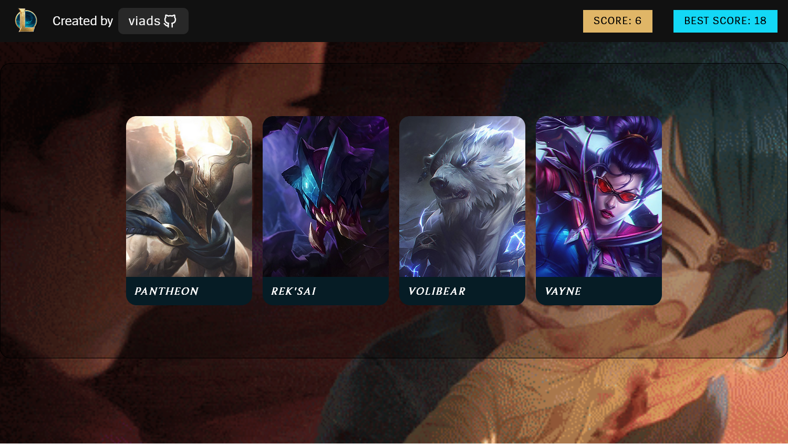

# Memory Card Game

The **Memory Card Game** project is created according to the assignment from **The Odin Project** [course](https://www.theodinproject.com/lessons/node-path-react-new-memory-card).
<br>
<br>



### 🔗 **Live preview** of the project is [here](https://alex-dishen.github.io/memory-card/).

## 🚀 **Getting Started**

```
HTTPS - git clone https://github.com/Viadsss/Memory-Game.git

SSH - git clone git@github.com:Viadsss/Memory-Game.git

cd Memory-Game

npm install

npm run dev
```

## 💡 **Things I've learned**

- UseEffect
- Shaping objects with Typescript
- Passing Props with types
- Structuring Components

## 🛠️ **Technologies**

- React
- Typescript
- CSS
